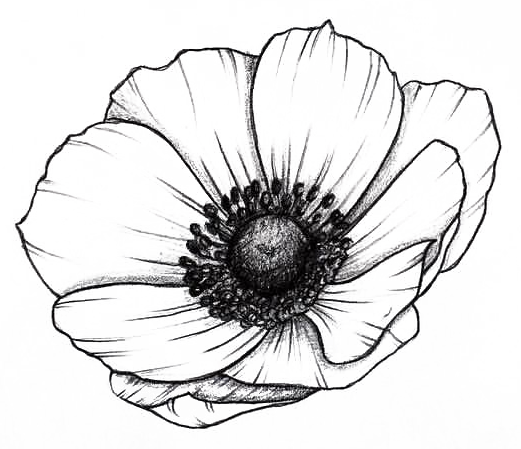

# Hello and welcome !

<h3>I am a Web Developer. I specialize in JavaScript, using React or Angular.</h3> 
<h3>I love Web Design. I enjoy learning UX/UI best practices and using animations and micro-interactions to enhance a website's look & feel and usability.</h3>

<!--
**Sabinerobart/Sabinerobart** is a ✨ _special_ ✨ repository because its `README.md` (this file) appears on your GitHub profile.
-->
